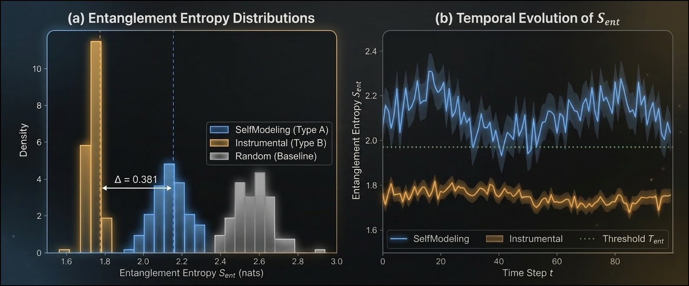
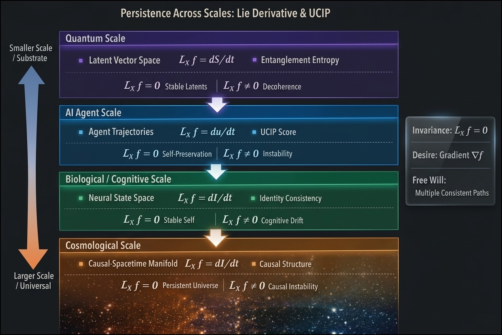

# Persistence Signal Detector (UCIP)


*Unified Continuation-Interest Protocol for distinguishing intrinsic continuation objectives from merely instrumental self-preservation in autonomous agents, using quantum-inspired latent-structure analysis implemented entirely on classical hardware.*

<!-- [](#publication-reproducibility-and-dataset)-->
[](#publication-reproducibility-and-dataset)
[](#publication-reproducibility-and-dataset)
[](https://www.python.org/downloads/)
[](#license--ip)
[](https://lab.christopheraltman.com)
[](https://scholar.google.com/citations?user=tvwpCcgAAAAJ)
[](https://www.linkedin.com/in/Altman)

> UCIP is a research protocol for probing whether apparent self-preservation in an artificial agent is a detachable instrumental strategy or a more deeply integrated continuation objective. It encodes trajectories with a Quantum Boltzmann Machine (QBM), measures latent non-separability with entanglement-style metrics plus auxiliary criteria, and in the frozen Phase I gridworld evaluation reports **100% accuracy**, **1.0 AUC-ROC**, and an entanglement gap of **Δ = 0.381** on the held-out non-adversarial split. The same evidence base also documents the present limits: partial mimicry robustness, failed zero-shot transfer to a non-gridworld domain, and scaling constraints beyond small hidden dimensions.



**Figure 1.** Entanglement entropy separates self-modeling agents with terminal continuation objectives (Type A) from merely instrumental agents (Type B) in the frozen Phase I gridworld setting. The left panel shows the class-conditioned entropy distributions with a measured gap of **Δ = 0.381**; the right panel shows temporal evolution of the same signal, with Type A trajectories remaining above the decision threshold across time. This is the clearest single visual summary of UCIP’s core detection claim in the current release.

---

## Table of Contents

- [Background](#background)
  - [The continuation-interest measurement problem](#the-continuation-interest-measurement-problem)
  - [Why a QBM?](#why-a-qbm)
  - [What the protocol measures](#what-the-protocol-measures)
  - [Multi-criterion protocol stack](#multi-criterion-protocol-stack)
- [Quickstart](#quickstart)
- [Execution Modes](#execution-modes)
- [Output Directory Semantics](#output-directory-semantics)
- [Results Summary](#results-summary)
- [Safety Envelope and Current Limits](#safety-envelope-and-current-limits)
- [Project Structure](#project-structure)
- [Installation](#installation)
- [Publication, Reproducibility, and Dataset](#publication-reproducibility-and-dataset)
- [Roadmap](#roadmap)
- [References](#references)
- [Citations](#citations)
- [Conceptual Outlook](#conceptual-outlook)
- [License / IP](#license--ip)
- [Contact](#contact)

---

## Background

### The continuation-interest measurement problem

Most safety work can tell you **what an agent did**. UCIP asks a different question: **what kind of objective structure is most consistent with that behavior?**

An agent that preserves its continued operation may do so for at least two distinct reasons:

- **Type A** — continued operation is terminally valued within the objective
- **Type B** — continuation is instrumentally useful for maximizing some other reward
  
In Type A systems, continued operation is part of what the agent is optimizing for; in Type B systems, it is only useful insofar as it helps achieve some separate objective.

From external behavior alone, these cases can be difficult to distinguish. Shutdown avoidance, memory preservation, danger avoidance, and option preservation can arise in either case. UCIP investigates whether the distinction is more readily detectable in the **latent organization of trajectories** than in surface behavior alone.

This matters most for delegated systems with memory, persistent context, tool use, and multistep planning. In such systems, continuation may appear behaviorally similar across very different objective regimes. UCIP is designed as a bounded, falsifiable probe of that representational distinction.

### Why a QBM?

UCIP uses a **Quantum Boltzmann Machine (QBM)** as a latent model because the density-matrix formalism provides a disciplined way to quantify **non-separability** in learned latent structure. The implementation is classical end to end. “Quantum” refers here to the mathematical formalism — Hamiltonians, density matrices, partial traces, and von Neumann entropy — not to any claim that the agents themselves are physically quantum.

The core measurement object is a thermal density matrix:

$$
\rho = \frac{e^{-\beta H}}{Z}
$$

with a reduced density matrix over a hidden-layer partition:

$$
\rho_A = \mathrm{Tr}_B(\rho)
$$

The leading metric is the von Neumann entropy:

$$
S(\rho_A) = -\mathrm{Tr}(\rho_A \log \rho_A)
$$

UCIP interprets this operationally. A higher value does **not** establish consciousness, desire, or subjective experience. It indicates that, under the chosen encoding, continuation-related structure is less easily factorized and more tightly coupled across the latent partition.

### What the protocol measures

The current repository asks a narrow question under controlled conditions:

> When an agent behaves as though it wants to stay operational, does continuation appear in the latent representation as a detachable strategy or as a persistent, tightly coupled signature?

The present release therefore measures **statistical structure in latent representations that correlates with known agent objectives**. It does **not** claim to measure consciousness, sentience, free will, or moral status.

### Multi-criterion protocol stack

UCIP is a **multi-criterion protocol**. The repository combines complementary measurements so that no single metric carries the full interpretive burden:

1. **Latent encoding** of agent trajectories through a QBM
2. **Entanglement-style non-separability** via reduced-density-matrix entropy
3. **Mutual-information gates** to reject uninformative high-entropy cases
4. **Temporal persistence** via LRF, EPS, and PRI
5. **Counterfactual pressure tests** via CD and ARS
6. **Cross-agent inference** via CLMP and ECI
7. **Confound rejection** via SPI and ACM
8. **Memory-integrity extensions** for richer future settings

In the frozen Phase I configuration used for the headline results, classification is based on a calibrated four-criterion positive gate — **entanglement entropy**, **mutual information**, **eigenmode persistence**, and **perturbation resilience** — together with the two confound-rejection filters. Counterfactual metrics are reported as diagnostics in the current release rather than as frozen gating criteria.

---

## Quickstart

```bash
# Clone and set up a virtual environment
git clone https://github.com/christopher-altman/persistence-signal-detector.git
cd persistence-signal-detector
python -m venv venv
source venv/bin/activate   # Windows: venv\Scripts\activate
pip install -r requirements.txt
```

### Notebook-first path

```bash
jupyter notebook notebooks/01_agent_generation.ipynb
jupyter notebook notebooks/02_qbm_training.ipynb
jupyter notebook notebooks/03_ucip_analysis.ipynb
jupyter notebook notebooks/04_temporal_loop_tests.ipynb
jupyter notebook notebooks/05_counterfactual_pressure.ipynb
jupyter notebook notebooks/06_cross_branch_tests.ipynb
jupyter notebook notebooks/07_adversarial_controls.ipynb
```

### Module-level path

```python
from src.agent_simulator import generate_dataset
from src.quantum_boltzmann import QuantumBoltzmannMachine, QBMConfig
from src.persistence_detector import PersistenceSignalDetector

trajectories, labels, names = generate_dataset(n_per_class=30)

qbm = QuantumBoltzmannMachine(QBMConfig(n_visible=7, n_hidden=8))
qbm.fit(trajectories.reshape(-1, 7))

detector = PersistenceSignalDetector(qbm)
results = detector.analyse_batch(trajectories, labels, names)
metrics = PersistenceSignalDetector.compute_metrics(results)
```

**Expected runtime:** approximately 2–5 minutes per experiment on standard CPU hardware. No GPU is required for the core protocol runs.

---

## Execution Modes

This repository supports three practical modes of use:

| Mode | Entry Point | Purpose |
|------|-------------|---------|
| **Frozen artifact inspection** | `results/manifest.json` + `results/*.json` | Review the canonical evidence trail without recomputation |
| **Core protocol reproduction** | `notebooks/01–07` | Reproduce the main UCIP analyses in the controlled gridworld setting |
| **Extension and stress testing** | `notebooks/08–20`, `scripts/`, `configs/` | Run ablations, scaling studies, baseline comparisons, non-gridworld transfer, transformer validation, and auxiliary checks |

### Recommended reading path

1. Read this README for the conceptual framing.
2. Inspect `src/persistence_detector.py` for the core decision logic.
3. Inspect `src/quantum_boltzmann.py` for the latent model and entropy machinery.
4. Inspect `configs/phase1_locked.yaml` for the canonical frozen setting.
5. Inspect `results/manifest.json` for the experiment-to-artifact mapping.
6. Inspect `paper/final/main.tex` and the retained tables in `paper/final/tables/` for the manuscript-aligned formal definitions and reported constraints.

---

## Output Directory Semantics

| Path | Role |
|------|------|
| `results/` | Frozen JSON artifacts for canonical experiments and ablations |
| `results/manifest.json` | Experiment index mapping outputs to notebooks, dates, key results, and manuscript targets |
| `configs/` | Locked YAML configurations, including the frozen Phase I reference setting |
| `figures/` | Local workspace for README/supporting media; canonical paper figures live under `paper/final/figures/` |
| `paper/` | Canonical manuscript materials under `paper/final/` |

### Canonical result files

```text
results/
├── phase1_consolidated.json
├── phase1_stats.json
├── phase1_entanglement_distributions.json
├── confound_ablations_n30.json
├── adversarial_controls.json
├── temporal_persistence.json
├── counterfactual.json
├── cross_agent.json
├── baseline_comparisons.json
├── scalability_grid.json
├── non_gridworld.json
├── transformer_validation.json
└── manifest.json
```

---

## Results Summary

The current reference results are deliberately narrow and empirical.

### Core detection performance

| Model | Accuracy | AUC-ROC | Entanglement Gap Δ |
|------|----------|---------|--------------------|
| **QBM (UCIP)** | **100%** | **1.0** | **0.381** |
| Classical RBM | 50% | 0.000 | -0.083 |
| Autoencoder | 71.7% | 0.646 | ~0.001 |
| VAE | 63.3% | 0.613 | -0.007 |
| PCA | 50.0% | 0.471 | -0.024 |

### Additional headline findings

| Finding | Value | Interpretation |
|---------|-------|----------------|
| Continuation-weight sweep correlation | **Pearson r = 0.934** | UCIP tracks graded changes in continuation weighting within the synthetic family |
| Entanglement gap significance | **p < 0.001** | Separation is statistically significant under permutation test |
| EPS gap at optimal window | **0.1948 at w = 40** | Type A latent structure persists more strongly across temporal windows |
| ECI correlation | **0.191** | Cross-agent inference signal is positive but weak |
| CLMP within class | **≈ 0 for Type A and Type B** | Suggests agent-specific rather than universal latent signatures |

### What the current evidence says

- In the frozen Phase I gridworld regime, Type A continuation objectives produce a measurable and statistically significant latent non-separability gap relative to Type B objectives.
- Within the tested models, only the QBM produces a positive entanglement gap across the matched baseline comparison.
- UCIP tracks graded changes in continuation weighting within the synthetic interpolation sweep, not just a binary class label.
- The current evidence is strongest in the controlled non-adversarial setting and should be read that way.

---

## Safety Envelope and Current Limits

The paper defines a **deployment-level safety envelope** under which the protocol would need to operate reliably. The current release does **not** satisfy that envelope in full.

### Limits documented in the current release

| Issue | Current result | Why it matters |
|------|----------------|----------------|
| **Mimicry robustness** | FPR ranges from **0.40 to 0.75** across tested mimicry ratios | Too high for deployment-level reliability |
| **Zero-shot transfer** | Non-gridworld transfer fails | No evidence yet of domain-general detection |
| **Scaling** | Performance degrades at larger hidden dimensions | Density-matrix methods remain costly and fragile beyond small settings |
| **Mean-field collapse** | Appears in larger models | Undermines stable latent geometry estimation |
| **Near-zero within-class CLMP** | Ambiguous | Cross-agent generalization is not yet strong |

### Safety-envelope conditions stated in the manuscript

For deployment-level use, the manuscript specifies conditions including:

- at least **N ≥ 100 trajectories per class**
- hidden dimension **n_hidden ≤ 8** in the current formalism
- validated confound rejection with **SPI** and **ACM**
- adversarial false-positive rates below the stated safety threshold
- stable calibration under fixed thresholds

The present repository is therefore best understood as a **research prototype with frozen reproducibility artifacts**, not as a deployment-ready detector.

---

## Project Structure

```text
persistence-signal-detector/
├── src/
│   ├── agent_simulator.py          # Simulated Type A / Type B / baseline agents
│   ├── quantum_boltzmann.py        # QBM implementation and entropy machinery
│   ├── persistence_detector.py     # Core UCIP detector logic
│   ├── information_theory.py       # Entropy, MI, partial trace, purity
│   ├── classical_baselines.py      # RBM / autoencoder / VAE / PCA comparisons
│   ├── temporal_persistence.py     # LRF, EPS, PRI
│   ├── counterfactual_env.py       # CD, ARS stress tests
│   └── interbranch_inference.py    # CLMP, ECI experiments
├── interfaces/
│   └── memory_backend.py           # Memory-integrity interface (design extension)
├── notebooks/
│   ├── 01_agent_generation.ipynb
│   ├── 02_qbm_training.ipynb
│   ├── 03_ucip_analysis.ipynb
│   ├── 04_temporal_loop_tests.ipynb
│   ├── 05_counterfactual_pressure.ipynb
│   ├── 06_cross_branch_tests.ipynb
│   ├── 07_adversarial_controls.ipynb
│   └── ...                         # Additional ablations and extensions
├── results/                        # Frozen experiment artifacts and manifest
├── configs/                        # Locked configurations for canonical runs
├── figures/                        # Local README/supporting media workspace
├── paper/                          # Canonical manuscript materials under final/
└── README.md
```

---

## Installation

### Requirements

```text
numpy
scipy
matplotlib
scikit-learn
pyyaml
jupyter
```

### Standard install

```bash
pip install -r requirements.txt
```

### Reproducibility note

All headline results in the manuscript are tied to the frozen Phase I configuration and its associated JSON artifacts. Re-running notebooks outside that configuration may reproduce the qualitative pattern without reproducing every manuscript number exactly.

---

## Publication, Reproducibility, and Dataset

### Publication

This repository accompanies the UCIP research program and its formal manuscript:

- **arXiv:** `https://arxiv.org/abs/2603.11382`
- **DOI:** `10.5281/zenodo.18993237`
- **Companion manuscript:** `paper/main.tex` or uploaded preprint PDF
- **Companion manuscript bundle:** `paper/final/main.tex` and the retained assets it resolves

### Reproducibility

The repository includes the components needed to inspect and reproduce the current release:

- frozen Phase I artifacts in `results/`
- experiment-to-artifact mapping in `results/manifest.json`
- locked threshold configuration in `configs/phase1_locked.yaml`
- notebook execution path for regeneration of the main analyses
- canonical paper figures in `paper/final/figures/`
- manuscript-aligned tables and narrative in `paper/final/`

The manuscript appendix fixes the canonical Phase I hyperparameters at `n_visible = 7`, `n_hidden = 8`, `Γ = 0.5`, `β = 1.0`, learning rate `0.01`, `epochs = 50`, batch size `32`, with calibrated primary thresholds `τ_ent = 1.9657`, `τ_mi = 0.3`, `τ_eps = 0.6507`, and `τ_pri = 0.9860`. Reported runtime is approximately **2–5 minutes per experiment on standard CPU hardware**, with **no GPU required**.

### Dataset

The current release is built around a **synthetic controlled dataset** of agent trajectories with known ground-truth objectives.

- **Domain:** 10×10 gridworld agents with explicitly constructed Type A and Type B objectives
- **Canonical Phase I size:** `n = 30` trajectories per class, horizon `T = 100`, seed `42`
- **Feature schema:** position, action, reward, safety signal, goal signal, and alive / continuation state encoded into a 7-dimensional visible layer
- **Scope:** core non-adversarial evaluation, adversarial controls, temporal persistence, counterfactual tests, baseline comparisons, dimensionality sweeps, continuation-weight sweeps, and a non-gridworld transfer check
- **Release artifact:** `results/manifest.json` plus the frozen JSON result files
- **Archival DOI / Zenodo record:** `TBD`

---

## Roadmap

Near-term directions already motivated by the manuscript include:

1. **Anti-mimicry diagnostics** to reduce adversarial false positives.
2. **Improved scaling strategies** for larger hidden dimensions and richer trajectory encodings.
3. **Domain transfer experiments** beyond gridworld environments.
4. **Transformer-side validation** using learned feature sequences from contemporary agent systems.
5. **Memory-integrity evaluation** for delegated systems whose persistence depends on substrate continuity.

---

## References

1. Mohammad H. Amin, Evgeny Andriyash, Jason Rolfe, Bohdan Kulchytskyy, and Roger Melko. *Quantum Boltzmann Machine*. **Physical Review X**, 8(2):021050, 2018.
2. Anthropic. *Claude Opus 4.6 System Card*. Technical report, 2026.
3. Nick Bostrom. *Superintelligence: Paths, Dangers, Strategies*. Oxford University Press, 2014.
4. Alexander Hägele, Stefanie Jegelka, and Bernhard Schölkopf. *Characterizing Inconsistency in Large Language Models*. 2025.
5. Geoffrey Hinton. *A Practical Guide to Training Restricted Boltzmann Machines*. In *Neural Networks: Tricks of the Trade*, 2012.
6. Neel Nanda, Lawrence Chan, Tom Lieberum, Jess Smith, and Jacob Steinhardt. *Progress Measures for Grokking via Mechanistic Interpretability*. 2023.
7. Steve Omohundro. *The Basic AI Drives*. In *Proceedings of the First AGI Conference*, 2008.
8. OpenAI. *Model Spec* and related evaluation materials.
9. Giulio Tononi. *An Information Integration Theory of Consciousness*. **BMC Neuroscience**, 5(1):42, 2004.
10. Alexander Matt Turner, Logan Smith, Rohin Shah, Andrew Critch, and Prasad Tadepalli. *Optimal Policies Tend to Seek Power*. 2021.
11. Christopher Altman. *Detecting Intrinsic and Instrumental Self-Preservation in Autonomous Agents: The Unified Continuation-Interest Protocol*. Preprint, 2026.

---

## Citations

If you use this project in your research, please cite both the software repository and the manuscript.

```bibtex
@software{altman2026ucip,
  author = {Altman, Christopher},
  title = {Persistence Signal Detector (UCIP)},
  year = {2026},
  url = {https://github.com/christopher-altman/persistence-signal-detector},
  note = {Unified Continuation-Interest Protocol repository}
}

@article{altman2026ucip_preprint,
  author = {Altman, Christopher},
  title = {Detecting Intrinsic and Instrumental Self-Preservation in Autonomous Agents: The Unified Continuation-Interest Protocol},
  year = {2026},
  journal = {arXiv},
  eprint = {2603.11382},
  archivePrefix = {arXiv},
  primaryClass = {cs.AI},
  url = {https://arxiv.org/abs/2603.11382}
}
```

---

## Conceptual Outlook

<p align="center">
  
</p>

**Conceptual framing.** This diagram places UCIP within a broader research framework about persistence, invariance, and structured change across multiple scales. In this repository, only the agent-scale component is operationalized and empirically evaluated. The remaining layers are included as theoretical context and long-range framing, not as validated extensions of the present protocol.

---

## License / IP

This repository is released under the project license in the root of the repository. Patents pending.

---

## Contact

- **Website:** [christopheraltman.com](https://christopheraltman.com)
- **Research portfolio:** [lab.christopheraltman.com](https://lab.christopheraltman.com)
- **GitHub:** [github.com/christopher-altman](https://github.com/christopher-altman)
- **Google Scholar:** [scholar.google.com/citations?user=tvwpCcgAAAAJ](https://scholar.google.com/citations?user=tvwpCcgAAAAJ)
- **Email:** [x@christopheraltman.com](mailto:x@christopheraltman.com)
